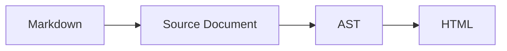

# Media

Media is the most expensive content on a documentation page and the least
verified. A screenshot is a claim about the product exactly as much as a
sentence is, and it rots the same way.

## Images

Use the `image` component rather than raw Markdown when you want dimensions,
dark-mode variants, captions, or zoom:

```markdown
::image{src="/assets/dashboard.png" alt="The deployment list, showing three successful builds" width=1280 height=720 caption="Deployments are listed newest first"}
```

| Prop | Why it matters |
|---|---|
| `alt` | Required. What the image *says*, for a reader who cannot see it |
| `width`, `height` | Prevents layout shift. Missing is [`W0714`](/errors/W0714) |
| `dark` | A separate file shown in dark mode |
| `caption` | Visible text, indexed and read by agents |
| `zoom` | On by default; opens the image full size |

Plain Markdown images work too, and an image with no alt text is
[`E0305`](/errors/E0305) either way.

### Alt text

Alt text describes the information, not the picture. "Screenshot of the
dashboard" tells a screen-reader user nothing. "The deployment list, showing
three successful builds and one failure" tells them what the sighted reader
learns.

An image that is purely decorative takes an empty alt (`alt=""`), which tells
assistive technology to skip it. That is a deliberate choice, not a shortcut for
not writing alt text.

### Formats and processing

Put files under `assets/`. The build generates responsive sizes and modern
formats at the breakpoints in `content.images.breakpoints`, serves WebP where
the browser accepts it, and keeps the original as a fallback. Files are copied
with stable URLs and optional content hashes (`build.hashing`).

Prefer SVG for diagrams and PNG for screenshots with text. Photographs are rare
in documentation and usually decorative.

:::note{title="Metadata is stripped"}
Uploaded and processed images have their metadata removed, and SVGs are passed
through an allow list rather than served as authored. A screenshot of a
dashboard often carries the author's username, device, and location in EXIF.
:::

## Screenshots that verify themselves

A screenshot taken by hand is stale the moment the UI changes, and nobody
notices until a reader does. The `screenshot` component names what should be
captured rather than pointing at a file somebody made:

```markdown
::screenshot{src="/assets/deployments.png" alt="The deployment list" app="dashboard" route="/deployments" viewport="1280x800"}
```

The verification run drives the named application to that route, captures it,
and compares it with the stored image. A difference beyond tolerance is
[`E0608`](/errors/E0608). This needs the companion runtime; without it the
stored image is served as an ordinary image and the check is skipped.

## Video

```markdown
::video{src="/assets/tour.mp4" poster="/assets/tour-poster.png" caption="A tour of the editor" controls}
```

Host video yourself when it is short and central, and embed it when it is long.
`autoplay` requires `muted`, because browsers will not honour it otherwise.

For embedded players, `title` is not optional in practice: a screen reader
announces the frame by its title, and "iframe" is not a useful announcement.

## Diagrams

Mermaid diagrams are written as fenced code, which means the source stays
readable, diffable, and available to agents:

````markdown

````

With the companion runtime installed, diagrams are pre-rendered to static SVG at
build time with pinned fonts, so they are deterministic and need no JavaScript.
Without it, a pinned Mermaid bundle renders them in the browser and the fence
source is still served to agents and to readers with JavaScript off.

Prefer a diagram when the relationship is spatial, and a table when it is not.
A flowchart of three sequential steps is a numbered list that takes longer to
load.

## Downloads

```markdown
::file{src="/assets/liyasa-cheatsheet.pdf" name="Cheat sheet" size="240 KB"}
```

Any file referenced by a link with a non-page extension is copied to `dist/`
with a stable URL. Configure `Content-Disposition` per extension under
`build.downloads` when a file should download rather than open.

## Budgets

Media dominates page weight, and page weight is a documented budget rather than
an aspiration. A served HTML response above 1 MB is [`W0720`](/errors/W0720);
above 10 MB it is [`E0721`](/errors/E0721), because it exceeds the fetch buffers
agents document.

```sh
liyasa test --perf
```

## Next steps

[Accessibility](/guides/accessibility) covers alt text and media controls as
part of the wider picture, and [verification](/guides/verification) covers the
screenshot runner in detail.
